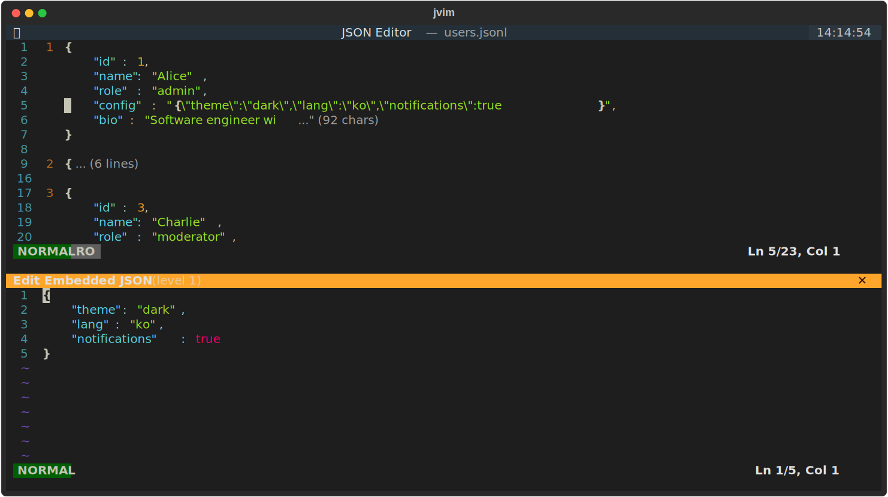
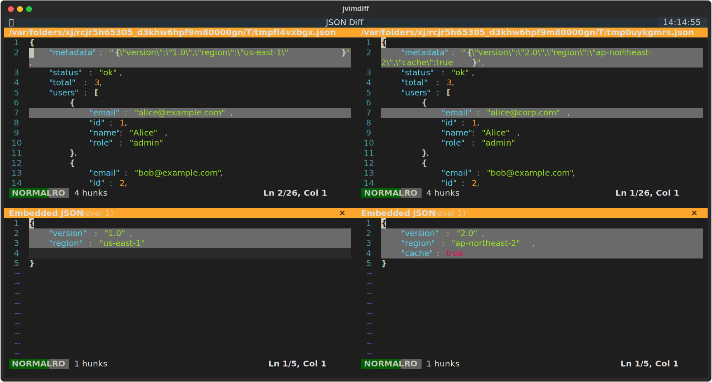

# jvim

[Textual](https://github.com/Textualize/textual) 기반의 vim 스타일 JSON 편집기입니다.

## 스크린샷

### 편집기


### Diff 뷰어


## 주요 기능

- **Vim 스타일 모달 편집** - Normal, Insert, Command, Search 모드 지원
- **구문 강조** - JSON 문법에 맞는 색상 표시
- **JSON 검증** - 실시간 유효성 검사 및 오류 표시
- **JSONPath 검색** - JSONPath 표현식으로 검색 (`$.foo.bar`)
- **JSONL 지원** - JSON Lines 파일을 스마트하게 포맷팅하여 편집
- **내장 JSON 편집** - JSON 내 문자열로 저장된 JSON을 중첩 레벨까지 편집
- **Visual 모드** - 문자 단위(`v`) 및 줄 단위(`V`) 선택 후 `d`/`y`/`c` 연산자 지원
- **접기(Folding)** - JSON 블록과 긴 문자열 값을 접기/펼치기
- **괄호 매칭** - `%`로 짝이 맞는 괄호로 이동
- **Undo/Redo** - 전체 실행 취소 기록 지원

## 설치

```bash
pip install jvim
```

## 사용법

```bash
# 파일 열기
jvim data.json

# 읽기 전용 모드로 열기
jvim -R data.json

# 새 파일 생성
jvim newfile.json
```

`jvi`, `jv` 단축 명령도 사용 가능합니다.

## JSONL 지원

jvim은 JSON Lines (`.jsonl`) 파일을 특별하게 처리합니다:

- **포맷팅된 편집**: 각 JSONL 레코드를 자동으로 들여쓰기하여 읽고 편집하기 쉽게 표시
- **압축 저장**: 저장 시 각 레코드를 한 줄로 압축하여 JSONL 형식 유지
- **레코드 번호**: 두 번째 열에 레코드 번호(1, 2, 3...)를 표시하여 쉽게 탐색
- **플로팅 헤더**: 여러 줄에 걸친 레코드를 스크롤할 때 물리적 라인 번호가 상단에 표시

예시: 두 개의 레코드가 있는 JSONL 파일:
```
{"name": "Alice", "age": 30}
{"name": "Bob", "age": 25}
```

jvim에서 열면:
```
{
    "name": "Alice",
    "age": 30
}
{
    "name": "Bob",
    "age": 25
}
```

저장하면 원래의 압축된 형식으로 복원됩니다.

## JSONPath 검색

jvim은 값 필터링이 가능한 강력한 JSONPath 검색을 지원합니다.

### 기본 JSONPath

`$.` 또는 `$[`로 시작하는 검색 패턴은 자동으로 JSONPath로 인식됩니다:

```
/$.name              # "name" 필드 찾기
/$..email            # 모든 "email" 필드 찾기 (재귀)
/$.users[0]          # 첫 번째 사용자
/$.users[*].name     # 모든 사용자 이름
```

### 값 필터링

비교 연산자를 사용하여 값으로 검색 결과를 필터링할 수 있습니다:

| 연산자 | 설명 | 예시 |
|--------|------|------|
| `=` | 같음 | `$.status="active"` |
| `!=` | 다름 | `$.status!=null` |
| `>` | 초과 | `$.age>18` |
| `<` | 미만 | `$.price<100` |
| `>=` | 이상 | `$.count>=5` |
| `<=` | 이하 | `$.count<=10` |
| `~` | 정규식 매칭 | `$.email~@gmail\.com$` |

### 예시

```
/$.users[*].age>30           # 30세 초과 사용자
/$.items[*].status="active"  # 활성 상태인 아이템
/$..name~^J                  # J로 시작하는 모든 이름
/$.price<=1000               # 1000 이하 가격
/$.config.enabled=true       # 활성화된 설정
```

### 검색 수정자

| 접미사 | 설명 |
|--------|------|
| `\j` | 모호한 패턴을 JSONPath 모드로 강제 |
| `\c` | 대소문자 무시 (정규식 텍스트 검색용) |
| `\C` | 대소문자 구분 (정규식 텍스트 검색용) |

### 히스토리

검색 및 명령어 히스토리가 `~/.jvim/history.json`에 자동 저장되며 다음 실행 시 복원됩니다. 검색(`/`) 및 명령(`:`) 모드에서 화살표 키(`↑`/`↓`)로 히스토리를 탐색할 수 있습니다.

## 내장 JSON 편집 (ej 모드)

JSON 파일에는 종종 이스케이프된 JSON 문자열이 값으로 포함됩니다. jvim은 이러한 중첩된 JSON 구조를 자연스럽게 편집할 수 있게 해줍니다.

### 사용 방법

1. JSON 문자열 값이 있는 라인에 커서를 위치
2. Normal 모드에서 `ej` 입력
3. 새 편집기 패널이 열리며 파싱되고 포맷팅된 JSON 표시
4. 구문 강조와 유효성 검사가 적용된 상태로 내장 JSON 편집
5. `:w`로 저장하여 부모 문서에 반영(압축됨) 또는 `:q`로 취소

### 중첩 레벨

내장 JSON 안의 내장 JSON도 편집할 수 있습니다:
- 패널 제목에 현재 중첩 레벨 표시: `Edit Embedded JSON (level 1)`
- 저장하지 않은 변경 사항이 있으면 `[+]` 표시
- `:w`로 부모 문서에 저장하고 편집 계속
- `:wq`로 저장하고 이전 레벨로 복귀
- `:q!`로 변경 사항을 버리고 이전 레벨로 복귀

### 예시

다음과 같은 JSON이 있을 때:
```json
{
    "config": "{\"host\": \"localhost\", \"port\": 8080}"
}
```

config 라인에서 `ej`를 사용하면:
```json
{
    "host": "localhost",
    "port": 8080
}
```

편집 후 저장하면, 부모 문서에 압축된 결과가 반영됩니다.

## 키 바인딩

jvim 내에서 `:help`를 입력하면 전체 키 바인딩을 확인할 수 있습니다.

## 라이선스

MIT
